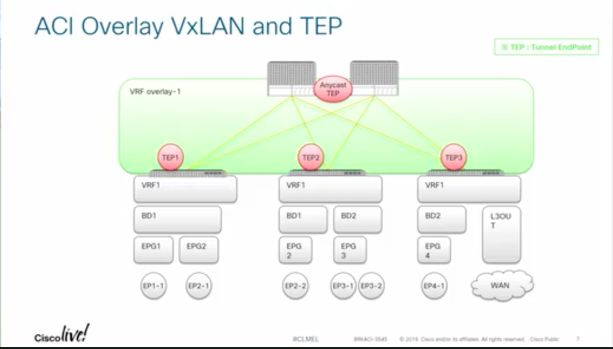

# The Life of Packet in ACI

This is a publically offered CiscoLive! 2020 presentations. You can find the [presentation here!](https://www.ciscolive.com/global/on-demand-library.html?#/video/15524933769930013Bz7) This is simply my notes for it, but they will obviously be very consistent with the presentation.

## Agenda

* Introduction
    + ACI Overlay VxLAN and TEP
* ACI Forwarding Components
    + Endpoints, EPG, EP Learning, COOP and How it all works
    + BD, VRF forwarding scope and detailed options
    + Spine-Proxy and ARP Glean
    + Forwarding Software Architecture and ASIC Generation
* ACI Packet  Walk
    + Walk through the life of a packet going through ACI

## Basic Acronyms/Definitions

| Acronyms | Definitions |
|:-:|:-:|
| ACI | Application Centric Infrastructure |
| APIC | Application Policy Infrastructure Controller |
| EP | Endpoint |
| EPG | Endpoint Group |
| BD | Bridge Domain | 
| VRF | Virtual Routing and Forwarding |
| COOP | Council of Oracle Protocol |
| VxLAN | Virtual eXtensible LAN |

### VxLAN Packet Acronyms

| Acronyms | Definitions |
|:-:|:-:|
| dXXXo| Outer Destination XXX (dIPo = Outer Destination IP)|
| sXXXo| Outer Source XXX (sIPo = Outer Source IP)|
| dXXXi| Inner Destination XXX (dIPi = Inner Source IP)|
| GIOp| Outer Multicast Group IP|
| VNID| Virtual Network Identifier|

## Basic Topology

__TEP__ is a tunnel endpoint address and each spine has one. Tthe purpose of that would be bcause ... [TO BE CONTINUED]