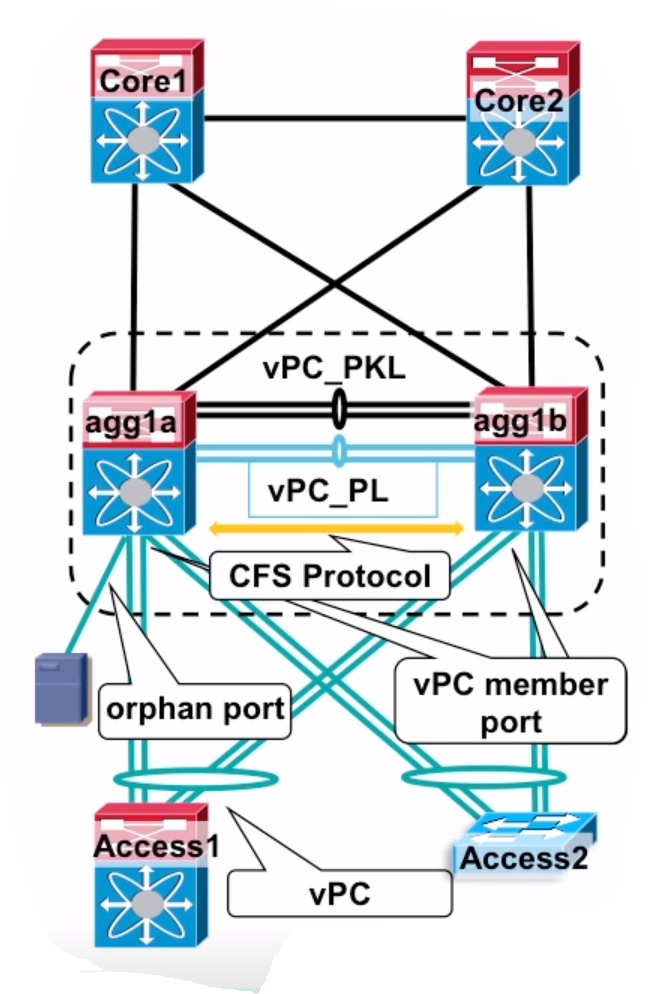
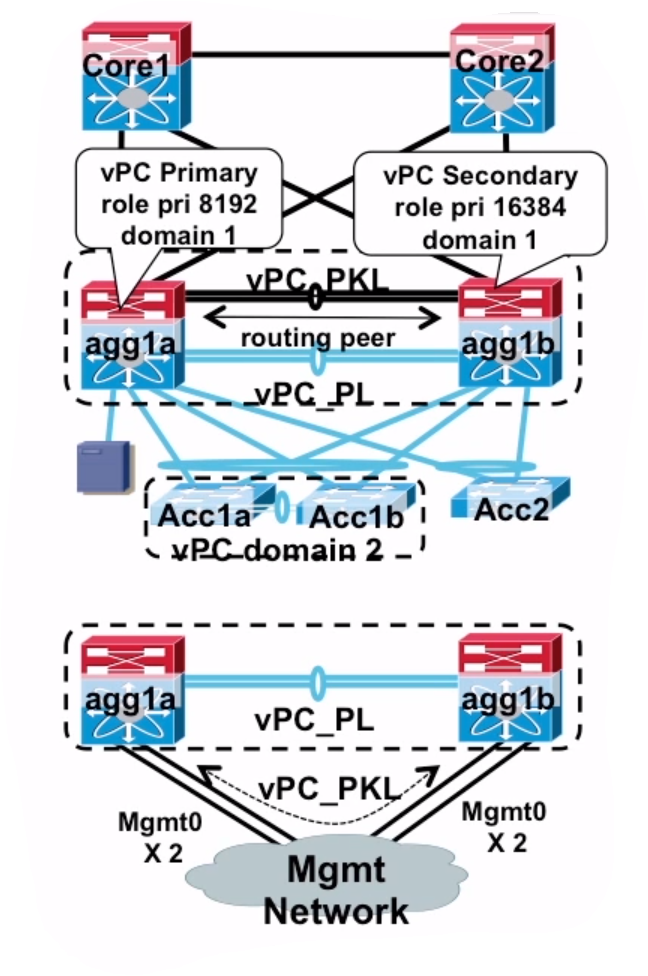
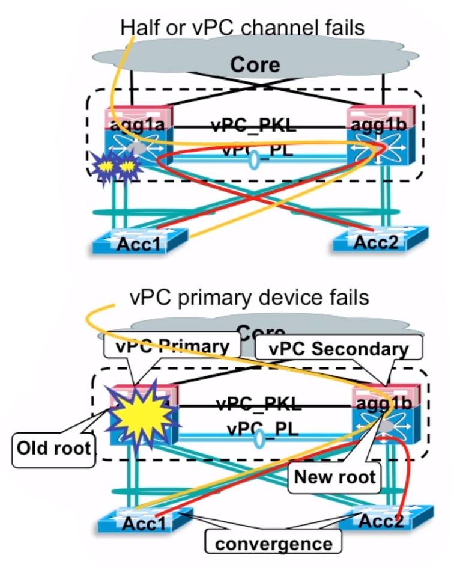

# Exploring vPC and its Components

Looking for [routing and switching based Etherchannel?](../../ROUTE-SWITCH/ETHERCHANNEL.md)

## Benefits of Etherchannel

* EtherChannel is often used between the switches in order to increase the capacity of the connection between them by performing a load balancing of the frames traversing the channel.
* Load sharing (balancing) is based on either source or destination MAC address of the transmitting computers when L2 etherchannel is used
* In case of an active link failure (the port in the channel that transmits the frames), the next link is going to transmit the packets with almost no delay
* The word _EtherChannel_, is a Cisco term. The industry standard name is __link aggregation__ or __IEEE 802.3ad__.

## Modes of Operations

Cisco offers two ways of configuring EtherChannel

1. Dyanamic channel negotiation using __Link Aggregation Control Protocol (LACP)__
which is the industry standard implementation
2. Manual channel configuration without using any form of negotiation

Etherchannel also helps bypass STP by bundling links to stop switches from blocking ports.

## Deeper look into LACP

Configure an EtherChannel using a dynamic exchange of packets that is compliant with industry standard method, NX-OS offers you two modoe options:

1. __active__ - ports are actively sending negotiation frames to the other switch, checking if the required parameters match and the channel can be safetly formed.
2. __passive__ ports are waiting for the negotiation frames from other switches in order to form a channel. The ports in passive mode __do not__ initiate any negotiations, but they will reply to negotiation frames received from a neigh

* if the parameters between ports are succinct (speed, duplex, trunking, VLANs allowed), the following modes will form an EtherChannel:
    + SW1 Active - SW2 Active
    + SW1 Active - SW2 Passive
    + SW1 Passive - SW2 Active

Finally, it is vital you do a final check of all port setting. The interfaces must be in _shutdown_ mode. This will avoid loops and othr issues while establishing EtherChannel.

### Now lets explore vPC

Despite implications of _Spanning Tree Protocol__ vPC allows us to use allow all the bandwidth available to us on switches.

## Virtual Port-Channel (vPC)

### vPC Terminology

* __vPC peer__ - a vPC switch, one of a pair
* __vPC member port__ - one of a set of ports (port channels) that form a vPC
* __vPC__ - the combined port channel between the vPC peers and the downstream device
* __vPC - peer-link (vPC_PL)__ - synchronize state between vPC peer devices (must be 10GE port-channel)
* __vPC peer-keepalive link (vPC_PKL__) - detect the status of vPC peer devices
* __CFS__ - Cisco Fabric Services protocol, used for state synchronization and configuration, validation between vPC peer devices.
* __vPC VLANs__ -  VLANs carried over the peer-link
* __Non-vPC VLANs__ - VLANs not carried over the peer-link
* __vPC orphan-ports__ - non vPC ports that are mapped to the vPC VLANs

## Implementation Best Practices

* Utilize diverse 10GE modules to form vPC peer-link
    + must be either M or F, can be mixed on each size
    + single 10GE module implementation is supported but not recommended
* Implement physical vPC peer-link ports in dedicated rate-mode
    + shared rate-mode is supported but not recommended
* Use a dedicated link for vPC peer keepalive link and assign it to a separate VRF
    + if mgmt0 interface is used as a vPC keepalivev linkm it should be connected to an OOB manage
    + back-t-back mgmt0 connection should only be used in single supervisor implementation
    * Do not use SVI interface between vPC peer-link as vPC keppalive link

## Understanding how vPC Functions

### vPC failure convergence summary

* no impact with vPC peer-keepalive link failure
* no impact with supervisor failover or ISSU (in-service software upgrade)
* when vPC channel member fails, traffic is re-hased over existing member
* when half of the vPC channel fails, traffic is re-hashed / re-routed to vPC peer
    + some traffic will traverse across vPC peer-link
* when vPC primary switch fails, traffic is re-hased / re-routed to vPC secondary switch
    + vPC-peer-switch implemented to eliminate STP convergence
* when vPC secondary switch fails, traffic is re-hased / re-routed to vPC primary switch

### vPC failure convergence summary

So what if the vPC peer-link fails?

* vPC peer-link fails, the secondary vPC peer suspends local vPC and shuts down SVIs of vPC VLANs
    + single-homed devices coneccted to vPC secondary devices will be isolated
    + dual-active does not occur if peer-keepalive link fails after vPC peer=link failure

