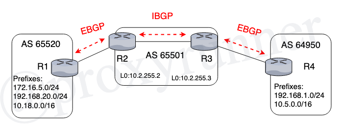

# Lesson 5.1 : Route Exchange over BGP

Click here to return to the [BGP Table of Contents](../README.md).

## Route Exchange over BGP

* 5.1 Understanding methods for specifying prefixes to be advertised over a BGP session
* 5.2 The routing informaiton databases (RIBs) used by BGP

## Injecting Prefixes into BGP

* Injecting prefixes using the _network_ statement
* Injecting prefixes using redistribution

## Using the network statement

> __network__ _PREFIX_ __mask__ _NETWORK-MASK_

* Do not confuse this with the IGP __network__ statement
    + IGP __network__ statement specifies interface addresses on which IGP runs
    + BGP __network__ statement specifies prefixes to be advertised
    + __mask__ option allows for exact prefix matching
* Prefix must be in the routing table before it can be injected
    + learned by IGP
    + learned by static route

## Injecting Prefixes with Redistribution



* Redistributing between BGP and IGPs is dangerous
    + Instabilities in IGP prefixes can destabilize BGP
    + Very large number of BGP prefixes can cause IGPs to fail
* To use redistribution safely:
    + configure static route for each prefix to be redistributed
    + redistribute the static route
    + use filters to ensure only the static prefixes of interest are redistributed.
* useful for route aggregation (Lesson 6)
* in most cases the __network__ statement is preferable

Notice the static routes are pointing towards Null0. This is a trick to get the static routes into the Unicast routing table so that BGP can pick them up.

### Router Configurations

```R1
router bg 65520
no synchronization
bgp log-neighbor-changes
neighbor 10.1.1.2 remote-as 65501
no auto-summary
!
ip route 10.18.0.0 255.255.0.0 Null0
ip route 172.16.5.0 255.255.255.0 Null0
ip route 192.168.20.0 255.255.255.0 Null0
```

```R2
router bop 65501
no synchronization
bgp log-neighbor-changes
neighbor 10.1.1.1 remote-as 65520
neighbor 10.2.255.3 remote-as 65501
neighbor 10.2.255.3 update-source Loopback0
no auto-summary
```

```R4
router bop 64950
no synchronization
bop log-neighbor-changes
neighbor 10.3.1.1 remote-as 65501
no auto-summary
!
ip route 10.5.0.0 255.255.0.0 Null0
ip route 192.168.1.0 255.255.255.0 Null0
```

## Validation

The routes are now in the BGP routing table, but still not pingable. Use this command to redistribute the static routes in BGP router configuration mode:

> redistribute static

Notice the greater than sign in the __show ip bgp__ table, this means that it is the best path.

---

[Previous Lesson](./4.2.md)

[Click here for the next lesson!](./5.2.md)
