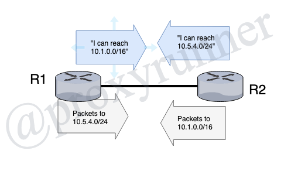

# BGP Attributes

Click here to return to the [BGP Table of Contents](../README.md).

## Basic BGP Policy Concepts

* BGP Attributes
    + Routing policy basics
    + Overview of all BGP path attributes

## Routing Policy Basics

* Route advertisements are a "promise" to deliver packets to the advertised prefixes
    + Outgoing advertisements affect incoming traffic
    + Incoming advertisements affect outgoing traffic

* Routing policies change the characteristics of advertised routes
    + And therefore effect traffic flowing in the opposite direction
* BGP path attributes:
    - Are a set of characteristics linked to NLRI that can be added or changed 
    - Influence the BGP decision process for selecting best paths

## BGP Path Attribute Classification

Two classes of attributes, each with two sub-classes:

1. Well-Known:
    * All BGP implementations must understand this attribute
        +  Well-Known Mandatory:
            - An NLRI __must__ have this attribute
        + Well-Known Discretionary:
            - An NLRI might or might not have this attribute
2. Optional:
    * A BGP implementation might or might not understand this attribute
        + Optional Transitive:
            - This attribute is accepted and passed along with the NLRI even if it is not  understood (transitive bit is set)
        + Optional Non-Transitive:
            - If the attribute is not supported it is quietly discarded

|Attribute|Class|RFC|Lesson|
|:-:|:-:|:-:|:-:|
|AS_PATH|Well-Known Mandatory|4271|1|
|NEXT_HOP|Well-Known Mandatory|4271|5|
|ORIGIN|Well-Known Mandatory|4271|5|
|ATOMIC_AGGREGATE|Well-Known Discretionary|4271|5|
|AGGREGATOR|Optional Transitive|4271|5|
|LOCAL_PREF|Well-Known Discretionary|4271|11|
|MULTI_EXIT_DISC (MED)|Optional Non-Transitive|4271|12|
|COMMUNITIES|Optional Transitive|1997|16|
|EXTENDED COMMUNITY|Optional Transitive|4360|16|
|AS4_PATH|Optional Transitive|4893|Not Covered|
|AS4_AGGREGATOR|Optional Transitive|4893|Not Covered|
|Cluster_List| Optional Non-Transitive| 4456|19|
|ORIGINATOR_ID| Optional Non-Transitive| 4456|19|
|MULTIPROTOCOL REACHABLE NLRI|Optional  Non-Transitive|4760|Not Covered|
|MULTIPROTOCOL UNREACHABLE NLRI|Optional  Non-Transitive|4760|Not Covered|

---

[Previous Lesson](../MOD1/6.2.md)

[Click here for the next lesson!](./7.2.md)
