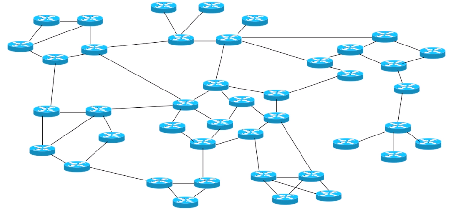
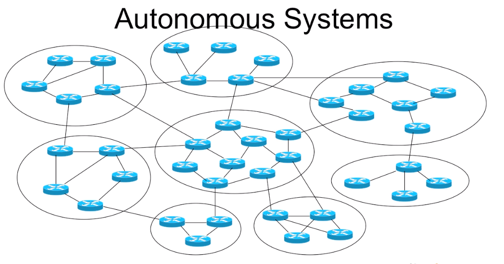
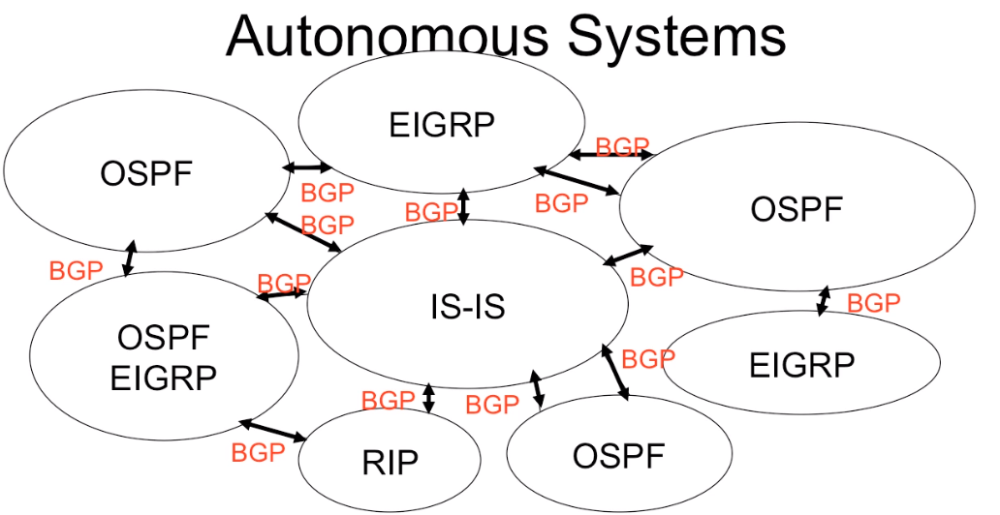

# Part I - Lesson 1: Basic BGP Concepts

[Click here to return to the BGP Table of Contents](../README.md)

## What is an Autonomous System?

A set of routers and networks under the control of a single administrative authority.

* Allows seperations of administrative domains
* IGPs run _within_ an AS
* IGPs route _between_ AS

Scaling was an issue for creating ARPA net (predescessor of Internet)

### Problems Scaling

### Separating Domains

### Back to Autonomous Systems

Moving forward...

* EGPs route _between_ autonomous systems
* BGP routes _among_ autonomous systems

## 1.1 Inter-domain concepts

### Autonomous System Numbers

* 16 bits
*  assigned by Regional Internet Registries, just like public IP addresses
* Public AS number
    + 1 - 64511
* Private AS number
    + 64512 - 65534
* Reserved AS Numbers
    + 0 and 65535
* New 32-bit AS numbers: RFC 4893

mBPG (multi-protocol BGP is not reviewed in this course. mBGP deals a lot with _address families_, meaning IPv4 __and__ IPv6.

For perspective between IGPs and BGP, IGPs find paths between routers, where BGP finds paths between _autonomous systems_.

### Trusted and Untrusted Peering

* IGP assumes its peers are trusted
    + all under the same administrative domain
    + therefore route exchange viewed holistically
* BGP assumes its peers are untrusted
    + under separate administrative domains
    + route information exchanged carefully
    + every external peering is viewed separately
    + incoming and ongoing route advertisements viewed separately

### Incoming and Outgoing Advertisements

* BGP session may:
    + carry advertisements in only one direction
    + carry advertisements in both directions
* BGP advertisement can:
    + associate a number of _path attributes_ with a prefix
    + path attributes enable routing policy

---

[Next Lesson](./1.2.md)