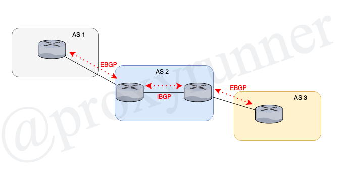
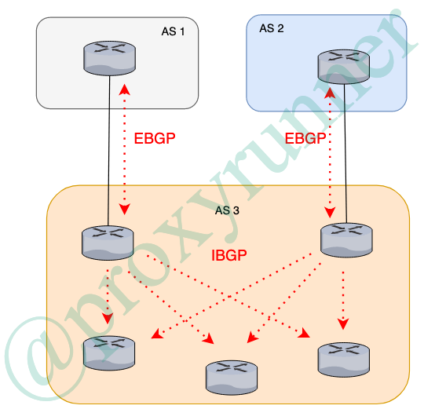

# Lesson 3: Configuring an IBGP Session

 * 3.1 : understanding a BGP session between peers in the same AS are discussed
 * 3.1 : using a topology with multiple routers within the same AS

 ## Configuring an IBGP Session

 * IBGP applications
 * similarities and differences between IBGP and EBGP
 * Unique IBGP issuess

 ## What is IBGP?

 * Internal BGP
 * Runs between neighbors in _the same_ autonomous system
 * Applications:
    + transports routes across a transit AS
    + transports routes internally in multihomed stub AS'

There will be many variations.  

## IBGP and EBGP

* Simialarities:
    + unicast point-to-point sessions
    + uses TCP port 179
* differences:
    + IBGP can traverse multiple router hops
        - EBGP (default) is between directly connected neighbors
* several intra-AS issues require special IBGP
    + Loop avoidance
    + next-hop address lookups
    + IGP synchronization
    +  Path redundancy
