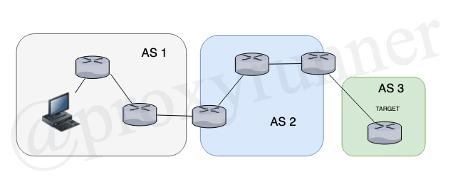

# 4.1 Configurating Multihop EBGP

* EBGP security risk
* TTL security feature
* EBGP TTL security

## EBGP Security Risk

EBGP is the most vulnerable of routing protocols, that is mostly the case because it is always public facing, thus allowing exposure to a greater volume of attacks.

