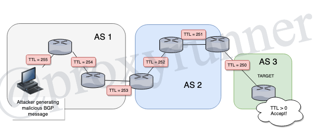

# 4.1 Configurating Multihop EBGP

Click here to return to the [BGP Table of Contents](../README.md).

* EBGP security risk
* TTL security feature
* EBGP TTL security

## EBGP Security Risk

EBGP is the most vulnerable of routing protocols, that is mostly the case because it is always public facing, thus allowing exposure to a greater volume of attacks.


* EBGP is the most vulnerable protocol
    + because it is at the AS boundary
    + exposed to outside access
* a router will accept an EBGP message with TTL >= 0
* EBGP messages can be sent from an attacker not directly connected
    + attack messages originated with TTL = 255



## TTL Security Options

* Has two effects:
    + Changes TTL of originated EBGP messages to 255
    + Changes default accepted TTL to >= specified value
* must be configured on __both__ neighbors
* replaces the multihop EBGP statement
    + has the same effect
    + incompatible with multihop EBGP statment

> __neighbor__ _IP-ADDRESS_ __ttl-security hops__ _HOP-COUNT_

```R1
router bgp 65501
!
neighbor 172.16.13.5  ttl-security hops 2
!
neighbor 172.16.13.5 ebgp-multihop 2
!
neighbor 172.16.13.5 update-source lo 0
!
```

---

[Previous Lesson](./4.1.md)

[Click here for the next lesson!](./#)
