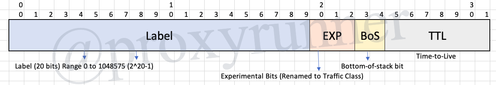
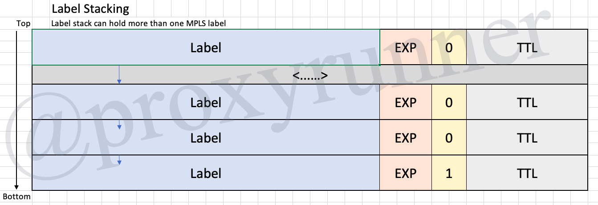

# 2.1 MPLS Labels, LSPs, and FECs

[Back](../README.md) to my repository!

## MPLS Label

* MPLS = Multiprotocol Label Switching
* The packet or frames are always switched based on the top label

* Label
    + 20 bits
    + Ranges from 0 to 1048575 (2^20-1)
* EXP = Experimental Bits (renamed to Traffic Class)
* BoS = Bottom-of-stack bit
* TTL = Time-to-live

## MPLS Label Stacking

* Label stack can hold more than one MPLS label

## MPLS Protocol Identifier

|Layer 2 Encapsulation Type|Layer 2 Protocol Identifier Name| Value(Hex)|
|:-:|:-:|:-:|
| PPP | PPP Protocol Field | 0281 |
| Ethernet/802.3 LLC/SNAP| Ethertype Value | 8847 |
| HDLC | Protocol | 8847 |
| Frame Relay | NLPID (Network Level Protocol ID) | 80 |

## Label Switch Router (LSR)

* __ingress LSRs__
    + Ingress LSRs are LSRs that receive a packet which is not labeled yet, inserts a label (stack) in front of the packet, and sends it out on a data link
* __egress LSRs__
    + Egress LSRs, are LSRs that receive labeled packets, remove the label(s) and send it out on a data link. Ingress and egress LSRs are edge LSRs
* __intermediate LSRs__
    + intermediate LSRs are LSRs that receive an incoming labeled packet, perform an operation on it, switch the packet, and send the packet out on the correct data link 

### Label Switched Path

* a label switched path (LSP) is a sequence of LSRs that switches a labeled packet through an MPLS network or part of an MPLS network

## FEC

* A **_Forwarding Equivalence Class (FEC)_** is a group or flow of packets that is forwarded along the same path and treated the same with regards to the forwarding treatment.

* All packets belonging to the same FEC thus have the same label
    + However, not all packets with the same label might belong to the same FEC because their EXP values might differ, so the forwarding treatment could be different and thus they could belong to a different FEC.
* the router that decides which packets belong to which FEC is the ingress LSR. This is logical because it is the ingress LSR that classifies and initially labels the packets.

### FEC Examples

* Packets with L3 and destination IP addresses matching a prefix
* multicast packets belonging to a certain group
* Packets with the same forwarding treament, based on the precedence of IP DiffServ Code Point (DSCP) field
* Layer 2 frames carried across an MPLS network received on one virtual circuit or (sub)interface on the ingress LSR and transmitted on one virtual circuit or (sub)interface on the egress LSR
* Packets with L3 destination IP address that belong to a set of BGP prefixes, all with the same BGP next hop

___

[Previous Lesson](./1.md)

[Click here for the next lesson!](./2.2.md)
