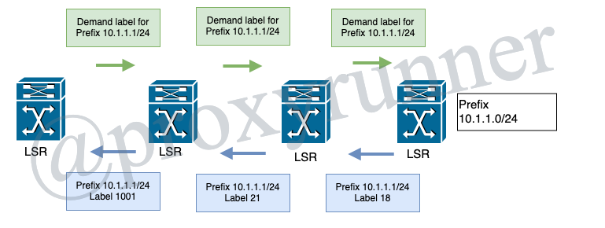
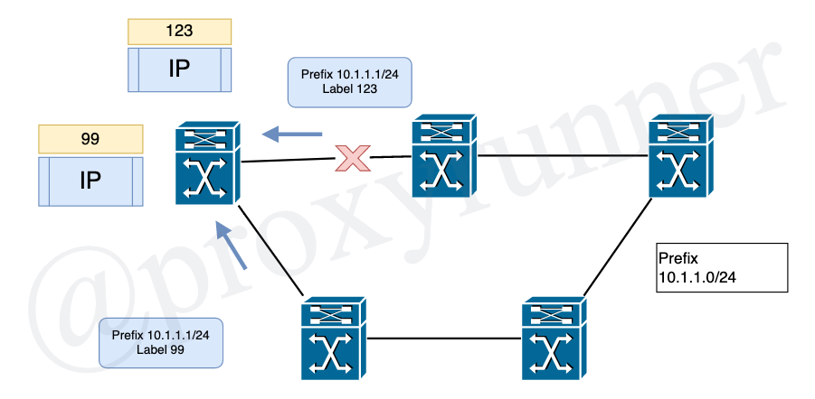

# Lesson 2: MPLS Architecture

[Back](../README.md) to my repository!

## 2.2 Label Distribution Protocols

### Why Distribute Labels?

* One LSP will carry the labelled packet
* Each LSR must know which label was assigned to which LSP by the previous LSR
* Each LSR must know which label to put on the packet for the next LSR

## Two Distribution Modes

* Downstream-on-Demand (DoD) label distribution mode
    + Each LSR requests its next hop (that is, downstream) LSR on an LSP; a label binding for the FEC
    + Each LSR receives one binding per FEC, only from its downstream LSR on that FEC
* Unsolicited Downstream (UD) label distribution mode
    + Each LSR distributes a binding to its adjacent LSRs, without those LSRs a requesting a label
    + An LSR receives a remote label binding from each adjacent LSR

### The Two Distribution Modes

* Downstream-on-Demand (DoD) label distribution mode
    + one remote binding
* Unsolicited Downstream (UD) label distribution mode
    + likely more than one binding

## UD Label Distibribution Mode

* Likely more than one binding received per prefix

## Label Retention Mode

* Two label retention modes
    + Liberal Label Retention mode
        - The LSR would keep all received remote bindings in the LIB
        - Quicker adaptation to routing changes
    + Conservative Label Retention Mode
        - The LSR stores only the remote binding associated with the next hop LSR for a particular FEC
        - Fewer labels to store

## LSP Control Modes

* There are two ways that LSRs can create a local binding for an FEC:
    + Independent LSP Control
        - The LSR can create a local binding for an FEC independntly from the other LSRs
        - The disadvantage is that some LSRs might begin to label switch packets before the complete LSR set up end-to-end and thus the packet would not be forwarded in the manner it should be forwarded
    + Ordered LSP Control mode
        - The LSR will only create a local binding for FEC, if it recognizes that it istself is the egress LSR for the FEC or if the LSR has received a label binding from the next hop for the FEC
        - Takes more time to create the LSP

> show mpls lpd

---

[Previous Lesson](./2.1.md)

[Click here for the next lesson!](./2.2.md)
