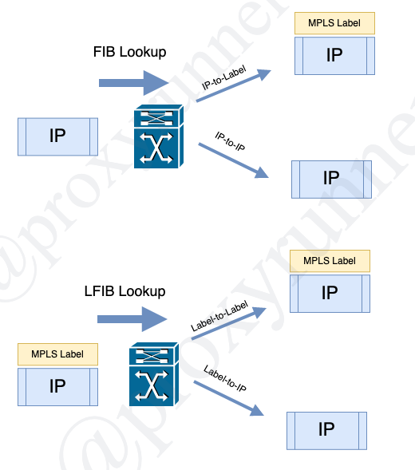

# Lesson 2: MPLS Architecture

[Back](../README.md) to my repository!

## 2.4 Label Forwarding Instance Base (LFIB)

### LFIB

* LFIB = Label Forwarding Instance BAse
    + A table to forward incoming labeled packets
    + Similar to FIB = Forwarding Instance Base
        - a table to forward IP packets
        - FIB is CEF (Cisco Express Forwarding) at Cisco

---

[Previous Lesson](./2.2.md)

[Click here for the next lesson!](./2.2.md)
